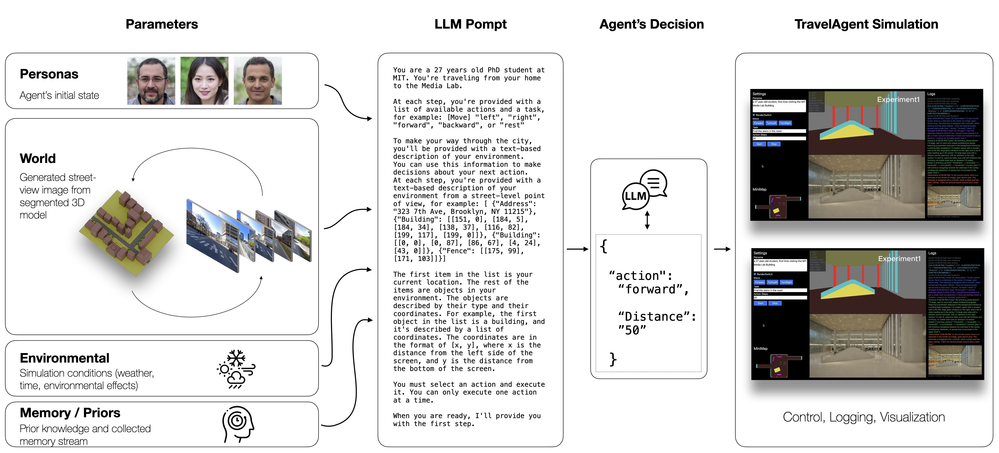

# TravelAgent
[TravelAgent](https://www.arielnoyman.com/travelAgent/) simulates human-like behaviors and experiences in diverse built environments. This repository hosts the code and the website for the TravelAgent.



# Folder Structure

- `<root>` : the website of the TravelAgent paper, which showcases the concepts, results described in our paper (The website is inspired by and built using the framework of the [Nerfies website](https://nerfies.github.io)).

- `interface` : The React App of TravelAgent user interface.

- `server` : Python backend server to run the image generation model.

- `server/logs`: All the experiment logs will be saved in this folder for further analysis.

- `analysis`: Notebooks to run the analysis in our paper.


# Setup

Please follow these instructions to initialize the project:

- interface: [README](interface/README.md)
- server:  [README](server/README.md)
- analysis: [README](analysis/README.md)

# Run the experiments

The web app provides an end-to-end experimentation environment for testing and
evaluating TravelAgents.

## Interface


- `left`:  Initial settings and inputs provided to the agent; 
- `Bottom Left`: Output log of the Chain-ofThought process. `orange` are the agent’s observations, `green` are the agent’s memories, `purple` are the agent’s plans,`blue` are the actions/decisions. 
- `Bottom Right`: A mini map show the path, the explored area, and current position of the agent.
- `Top`: Panoramic street-level view of the environment. The rudimentary 3D environment is guiding an SDXL image generation model to create eye-level images, as well as to provide depth estimation, and collision information. 

## Settings

Settings in TravelAgent allows users to change scenarios, agents’ profiles, and tasks by simply updating a short textual prompt.

- `Scenes`: the presetting senarios in our paper.
- `RenderSwitch`: Using image generation model or not.
- `CompassSwitch`: Using compass or not.
- `Prompt`: The prompt for image generation model.
- `Persona`: The persona of the LLM agent.
- `Move`: Manully control button to move the agent.
- `Task`: The task assigned to the agent to compelete.
- `Seed` : Random seed for the LLM agent and the Image generation model.
- `Experiment`: The name of the experiment and the respective log folder.
- `Action Steps`: The maximum steps the agent can take to finish this task.


# Citiation

If you find TravelAgent useful for you work please cite:

```
@article{noyman2024travelagent,
      title={TravelAgent: Generative Agents in the Built Environment},
      author={Noyman, Ariel and Hu, Kai and Larson, Kent},
      year={2024},
      journal={arXiv preprint},
    }
```


